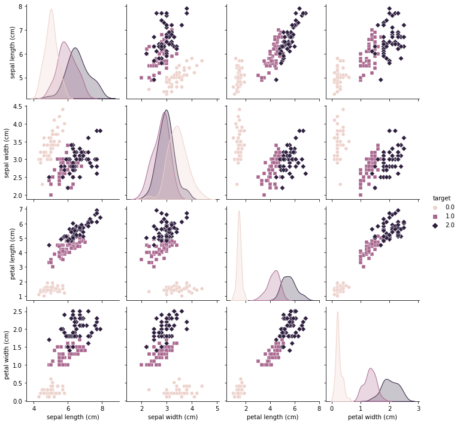

.. code:: ipython3

    # Import necessary libraries
    import pandas as pd
    import numpy as np
    import seaborn as sns
    import matplotlib.pyplot as plt
    from sklearn.model_selection import train_test_split
    from sklearn.preprocessing import StandardScaler
    from sklearn.neighbors import KNeighborsClassifier
    from sklearn.metrics import accuracy_score, classification_report, confusion_matrix
    
    # Load the Iris dataset
    from sklearn.datasets import load_iris
    iris = load_iris()
    iris_data = pd.DataFrame(data= np.c_[iris['data'], iris['target']], columns= iris['feature_names'] + ['target'])
    
    # Explore the dataset
    print(iris_data.head())
    
    # Visualize the relationship between features and target variable
    sns.pairplot(iris_data, hue='target', markers=["o", "s", "D"])
    plt.show()
    
    # Separate features (X) and target variable (y)
    X = iris_data.drop('target', axis=1)
    y = iris_data['target']
    
    # Split the dataset into training and testing sets
    X_train, X_test, y_train, y_test = train_test_split(X, y, test_size=0.2, random_state=42)
    
    # Standardize the features
    scaler = StandardScaler()
    X_train_scaled = scaler.fit_transform(X_train)
    X_test_scaled = scaler.transform(X_test)
    
    # Build a K-Nearest Neighbors (KNN) classifier model
    model = KNeighborsClassifier(n_neighbors=3)
    model.fit(X_train_scaled, y_train)
    
    # Make predictions on the test set
    y_pred = model.predict(X_test_scaled)
    
    # Evaluate the model
    accuracy = accuracy_score(y_test, y_pred)
    print(f"Accuracy: {accuracy * 100:.2f}%")
    
    # Print classification report and confusion matrix
    print("Classification Report:\n", classification_report(y_test, y_pred))
    print("Confusion Matrix:\n", confusion_matrix(y_test, y_pred))
    

.. parsed-literal::

       sepal length (cm)  sepal width (cm)  petal length (cm)  petal width (cm)  \
    0                5.1               3.5                1.4               0.2   
    1                4.9               3.0                1.4               0.2   
    2                4.7               3.2                1.3               0.2   
    3                4.6               3.1                1.5               0.2   
    4                5.0               3.6                1.4               0.2   
    
       target  
    0     0.0  
    1     0.0  
    2     0.0  
    3     0.0  
    4     0.0  
    

.. parsed-literal::

    Accuracy: 100.00%
    Classification Report:
                   precision    recall  f1-score   support
    
             0.0       1.00      1.00      1.00        10
             1.0       1.00      1.00      1.00         9
             2.0       1.00      1.00      1.00        11
    
        accuracy                           1.00        30
       macro avg       1.00      1.00      1.00        30
    weighted avg       1.00      1.00      1.00        30
    
    Confusion Matrix:
     [[10  0  0]
     [ 0  9  0]
     [ 0  0 11]]
    

