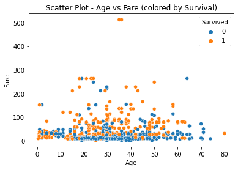

.. code:: ipython3

    # Import necessary libraries
    import pandas as pd
    import seaborn as sns
    import matplotlib.pyplot as plt
    from sklearn.model_selection import train_test_split
    from sklearn.ensemble import RandomForestClassifier
    from sklearn.metrics import accuracy_score, classification_report
    
    # Load the Titanic dataset
    # Provide the local path to the downloaded CSV file or use a different method to load the dataset
    # For example, you can upload it to GitHub and use the raw link
    URL = "https://raw.githubusercontent.com/PatilBasavaraj2000/Datasets/main/Titanic-Dataset.csv"  # Replace with the correct path or URL
    Titanic_Dataset = pd.read_csv(URL)
    
    # Explore the dataset
    print(Titanic_Dataset.head())
    
    # Preprocess the data
    # For simplicity, let's drop columns that may not contribute significantly to the prediction
    # Also, fill missing values and convert categorical variables into numerical format
    Titanic_Dataset = Titanic_Dataset.drop(['Name', 'Ticket', 'Cabin', 'Embarked', 'PassengerId'], axis=1)
    Titanic_Dataset['Sex'] = Titanic_Dataset['Sex'].map({'male': 0, 'female': 1})
    Titanic_Dataset = Titanic_Dataset.fillna(Titanic_Dataset.mean())
    
    # Separate features (X) and target variable (y)
    X = Titanic_Dataset.drop('Survived', axis=1)
    y = Titanic_Dataset['Survived']
    
    # Split the dataset into training and testing sets
    X_train, X_test, y_train, y_test = train_test_split(X, y, test_size=0.2, random_state=42)
    
    # Build a Random Forest Classifier model
    model = RandomForestClassifier(n_estimators=100, random_state=42)
    model.fit(X_train, y_train)
    
    # Make predictions on the test set
    y_pred = model.predict(X_test)
    
    # Evaluate the model
    accuracy = accuracy_score(y_test, y_pred)
    print(f"Accuracy: {accuracy * 100:.2f}%")
    
    
    
    # Scatter plot for Age vs Fare colored by Survival
    sns.scatterplot(x='Age', y='Fare', hue='Survived', data=Titanic_Dataset)
    plt.title('Scatter Plot - Age vs Fare (colored by Survival)')
    plt.xlabel('Age')
    plt.ylabel('Fare')
    plt.show()
    
    # Print classification report
    print("Classification Report:\n", classification_report(y_test, y_pred))
    

.. parsed-literal::

       PassengerId  Survived  Pclass  \
    0            1         0       3   
    1            2         1       1   
    2            3         1       3   
    3            4         1       1   
    4            5         0       3   
    
                                                    Name     Sex   Age  SibSp  \
    0                            Braund, Mr. Owen Harris    male  22.0      1   
    1  Cumings, Mrs. John Bradley (Florence Briggs Th...  female  38.0      1   
    2                             Heikkinen, Miss. Laina  female  26.0      0   
    3       Futrelle, Mrs. Jacques Heath (Lily May Peel)  female  35.0      1   
    4                           Allen, Mr. William Henry    male  35.0      0   
    
       Parch            Ticket     Fare Cabin Embarked  
    0      0         A/5 21171   7.2500   NaN        S  
    1      0          PC 17599  71.2833   C85        C  
    2      0  STON/O2. 3101282   7.9250   NaN        S  
    3      0            113803  53.1000  C123        S  
    4      0            373450   8.0500   NaN        S  
    Accuracy: 79.89%
    

.. parsed-literal::

    Classification Report:
                   precision    recall  f1-score   support
    
               0       0.81      0.87      0.83       105
               1       0.79      0.70      0.74        74
    
        accuracy                           0.80       179
       macro avg       0.80      0.78      0.79       179
    weighted avg       0.80      0.80      0.80       179
    
    

